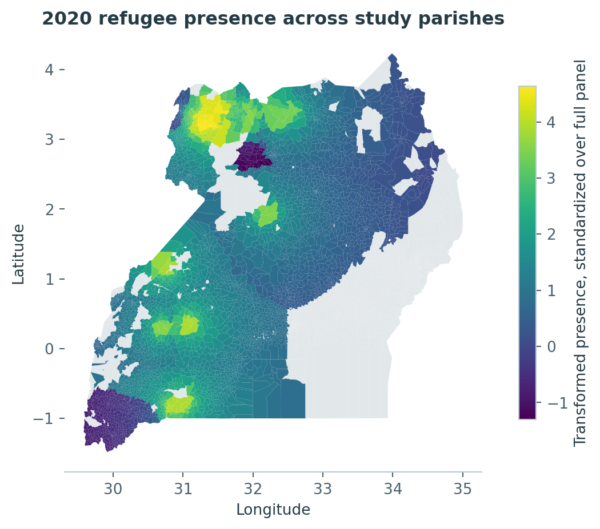
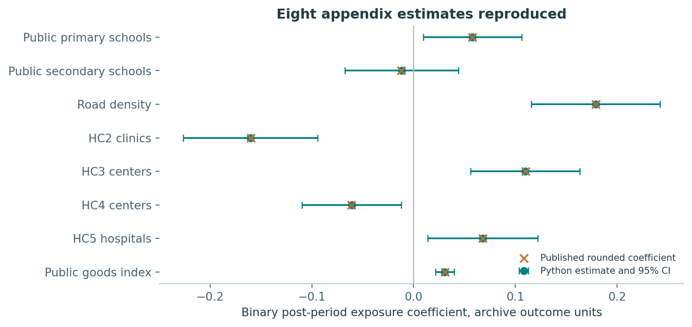
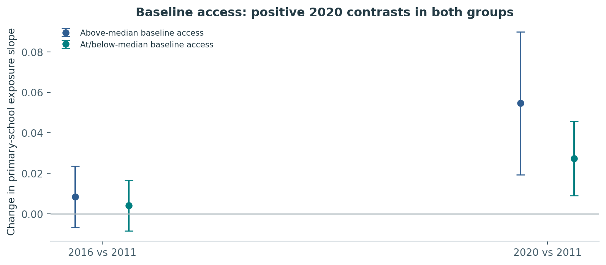
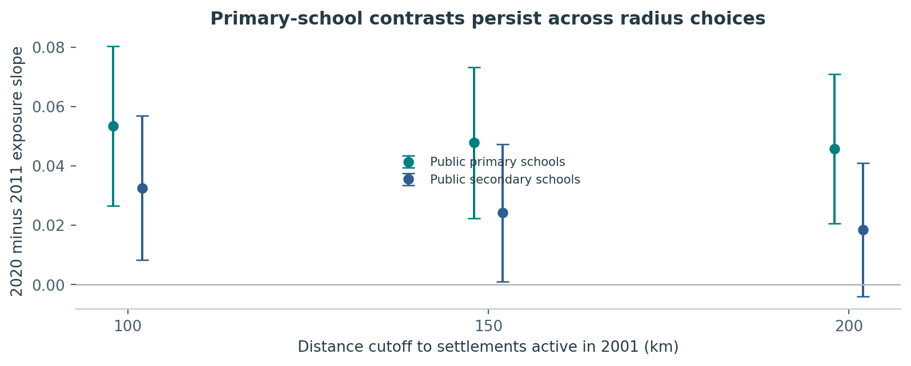

Research portfolio memorandum Prepared for Nicholas Reign Lugu 8 October 2026

This project reproduces selected public-service estimates from Zhou, Grossman, and Ge (2023) and examines whether changes in the relationship between refugee presence and school access differ with initial primary-school access. The evidence comes from the authors' public replication archive, rather than newly collected administrative records.

## Principal findings

The Python implementation reproduces all eight coefficients, clustered standard errors, and sample sizes in supplementary Table S16 at its published three-decimal precision. This is a selected-table replication, not a reproduction of the entire paper or of its public-opinion and health-utilization analyses.

In the continuous-presence specification, the 2020-versus-2011 primary-school slope contrast is 0.048 archive-standardized units (95% CI 0.022 to 0.073). Both baseline-access groups have positive estimated contrasts. Their difference is -0.027 (95% CI -0.058 to 0.003), so this standardized specification does not establish a difference at the 5% level.

A raw-unit sensitivity analysis gives a different inference for the group difference. The project therefore treats heterogeneity as specification-sensitive. Findings describe an exposure relationship in a refugee-hosting and aid context, with causal interpretation dependent on demanding observational assumptions.

Contribution: transparent econometric translation, quantitative reconciliation, geographic linkage, an exploratory heterogeneity analysis, and a documented reproduction workflow. This independent portfolio project has no institutional affiliation or endorsement from the original authors or Dartmouth.

## 1. Research question and study design

The substantive question is how host communities' public services change as refugee presence increases. A useful extension asks whether communities starting with lower service access experience a different change in this relationship. Such a distinction could inform further research on the distribution of development benefits, but this dataset cannot identify an optimal aid allocation rule.

The source study combines settlement population and distance measures with parish-level service indicators and baseline covariates. The released panel has 5,378 parishes observed in 2001, 2006, 2011, 2016, and 2020. The five waves are not annual observations, and 2014 is not an observed wave. The authors motivate pre/post comparisons around the large inflow and policy context of the mid-2010s [1].

This project has two distinct tasks. The confirmatory reproduction task follows the archived S16 code, including its treatment classification and exclusions. The exploratory task adds heterogeneity by baseline school access to the continuous-presence model. Its primary outcome is the archive-standardized public primary-school measure, with secondary schools as a comparator. The extension was selected after reviewing the source data and code, before fitting its models. It was not externally preregistered.

Figure 1. Original parish boundaries joined by P_02_ID to parish_id. Color represents 2020 presence, not a causal effect. Gray denotes locations outside the study radius or excluded for missing baseline controls. Geographic data use WGS84 coordinates.

## 2. Data management and measurement

The immutable source CSV has 26,890 records and 248 variables. The pipeline checks the parish-year key and expected waves, records source checksums, and retains the original raw file. There are no duplicate keys. Excluding records with missing baseline controls or contemporaneous settlement distance removes 1,055 rows, leaving 25,835. The 150km study restriction retains 18,185 rows from 3,637 parishes.

Check | Observed result
Panel structure | 5,378 parishes x 5 waves
Duplicate parish-year keys | 0
Incomplete baseline controls/distance | 1,055 rows excluded
Complete records within study radius | 18,185 rows / 3,637 parishes
S16 extra treatment exclusions | 7 rows outside archived bin boundaries
Geographic linkage | 5,378 boundary keys; all retained panel keys found

The pipeline constructs Nearest + 20 presence exactly as the archived model code specifies: use the inverse-hyperbolic-sine transform of the aggregate exposure measure within 20km when the closest settlement is within 20km, otherwise transform nearest-settlement exposure. It standardizes this variable over the full released panel before control and radius exclusions. The analysis sample uses min_distance_01, distance to settlements active in 2001. Those two distances serve different purposes.

S16 bins Nearest + 20 using quantiles of standardized Nearest, rather than quantiles of Nearest + 20 itself. Seven records fall outside these bin bounds. This implementation preserves that behavior to reproduce S16 and documents it explicitly. The binary classification is time-varying across post-period waves. It should not be interpreted as a fixed, randomly assigned treatment group.

Primary-school standardized outcomes have mean approximately zero and standard deviation one within each wave. They express relative positions within a year. Secondary-school units follow the supplied archive variable. Raw school measures are schools per thousand school-age children. Denominator changes can lower these ratios even if school counts rise. Health-tier standardized variables are missing in 2020, while roads are missing before 2011. No imputation fills these structural gaps.

## 3. Econometric implementation and identification

The continuous specification fits OLS with parish fixed effects and region-by-wave fixed effects. Refugee presence enters as a baseline term plus interactions with the 2006, 2011, 2016, and 2020 wave indicators. Thirteen baseline controls interact with available wave indicators. The controls cover census demographics and economic conditions, prior violence, and distances to oil, borders, roads, and the capital. Health and road models use the corresponding available waves.

Model: y_it = parish_i + region_wave_rt + b0 presence_it + sum_t b_t presence_it x wave_t + sum_t c_t controls_i x wave_t + error_it.

A post-2011 contrast is the difference between the 2020 or 2016 presence interaction coefficient and its 2011 counterpart. It measures a change in the conditional exposure slope. Because presence is continuous and time-varying, this is not a conventional event-study average treatment effect on a fixed treated population. Changing exposure distributions or heterogeneous responses may also change the interpretation of the slope.

Alternating projections remove fixed effects without constructing thousands of dummy variables. Column scaling and pivoted QR identify estimable regressors. The covariance estimator clusters by parish and applies a reghdfe-style small-sample correction that avoids counting parish effects nested inside the same clustering unit twice. Confidence intervals use a t distribution with G-1 degrees of freedom. Linear contrasts use the full covariance matrix, including covariance between coefficient estimates.

The supplemental binary model uses parish and pre/post-period effects, wave-interacted controls, and the archived post-period exposure indicator. Region effects are redundant with parish effects. All eight published S16 results provide an external numerical benchmark. A separate unit test compares absorbed OLS coefficients against explicit dummy-variable OLS on an unbalanced artificial panel.

Causal interpretation requires an appropriate conditional parallel-trends restriction, limited anticipation and spillovers, no unmeasured time-varying confounding linked to exposure, and comparable outcome measurement. Settlement placement is not random. Refugee hosting, humanitarian funding, and government responses occur together, so these estimates do not isolate the effect of refugees alone. Parish clustering also does not resolve possible dependence across nearby parishes. Additional spatial inference and design diagnostics would strengthen the analysis.

## 4. Published-table reconciliation

Figure 2. Supplementary Table S16 reproduction. The displayed units differ across outcomes. A common horizontal axis helps compare signs but does not imply that the measures share a substantive scale. The public-goods index remains in archive index units.

Outcome | Published | Python | N
Public primary schools | 0.058 (0.025) | 0.058 (0.025) | 18,178
Public secondary schools | -0.012 (0.029) | -0.012 (0.029) | 18,178
Road density | 0.179 (0.032) | 0.179 (0.032) | 10,904
HC2 clinics | -0.160 (0.034) | -0.160 (0.034) | 14,548
HC3 centers | 0.110 (0.027) | 0.110 (0.027) | 14,548
HC4 centers | -0.061 (0.025) | -0.061 (0.025) | 14,548
HC5 hospitals | 0.068 (0.028) | 0.068 (0.028) | 14,548
Public goods index | 0.031 (0.005) | 0.031 (0.005) | 18,178

Parentheses show parish-cluster standard errors. All eight estimates and standard errors round to the published values, and all eight sample sizes agree. Matching a rounded table establishes reproducibility at that precision. It does not establish exact machine-level agreement with the original R run, verify every upstream transformation, or independently validate the source records.

Results vary across service tiers. The reproduced binary coefficient is positive for primary schools, roads, HC3, HC5, and the index. HC2 and HC4 are negative. The secondary-school coefficient is small and uncertain. A single claim that all services improved would obscure this variation.

## 5. Continuous exposure and baseline-access extension

Figure 3. Differences in the continuous exposure slope relative to 2011, by baseline primary-school access. Intervals are pointwise parish-cluster 95% intervals. They are not adjusted for multiple comparisons.

The baseline moderator is a parish's raw public-primary-school access in 2001. The threshold is the median across all parishes with complete baseline controls: 2.174 schools per thousand primary-age children. At/below-median and above-median status remain fixed over time. This threshold is determined before applying the 150km radius, and the release includes the value needed to reproduce it.

The extension adds presence-by-baseline-group terms, their wave interactions, and baseline-group-by-wave terms. The latter allow group-specific common trends. The model retains all original baseline-control interactions and fixed effects. A raw-unit robustness check changes the outcome scale while retaining the same moderator and specification.

Primary schools, 2020 vs 2011 | Estimate | 95% CI
Above-median baseline access | 0.055 | 0.019 to 0.090
At/below-median baseline access | 0.027 | 0.009 to 0.046
Difference: lower minus higher access | -0.027 | -0.058 to 0.003

Both group estimates are positive, but comparing their separate significance levels is not a test of heterogeneity. The direct interaction contrast has p = 0.077, and its interval crosses zero. The standardized specification therefore supplies suggestive, imprecise evidence rather than a firm conclusion that one group benefits more.

In raw primary-school units, the 2020 group-difference contrast is -0.120 schools per thousand children per one-SD increase in transformed presence (95% CI -0.217 to -0.024; p = 0.014). Different wave standardizations change the estimand, so this result is not interchangeable with the standardized contrast. The secondary-school group difference remains uncertain on both scales. These exploratory p-values require caution given the set of comparisons and specification sensitivity.

## 6. Robustness, competing interpretations, and limits

Figure 4. Continuous-model 2020-versus-2011 exposure-slope contrasts using 100km, 150km, and 200km radius samples. Presence remains standardized over the original full panel across specifications.

The primary-school contrast is positive under all three radius choices, approximately 0.054, 0.048, and 0.046, respectively. The secondary-school interval crosses zero at 200km, illustrating greater sensitivity. Radius changes alter the sampled population as well as geographic reach. Stability across these cutoffs is useful, but it does not validate the identifying assumptions.

Raw nationwide average primary-school access falls from 2.706 schools per thousand children in 2001 to 1.630 in 2020. Positive relative exposure relationships can coexist with such an aggregate decline. This descriptive series is unweighted across parishes, not a national child-weighted access estimate, and cannot establish whether refugee hosting caused the decline.

The binary S16 coefficient and the continuous post-2011 contrasts answer different questions. For example, the index's reproduced binary coefficient is positive, whereas the continuous 2020-versus-2011 slope contrast is negative. This difference should trigger attention to exposure classification, timing, outcome composition, and functional form. It is not evidence that one implementation failed, and it prevents a blanket summary of uniform improvement.

This release does not estimate public attitudes, humanitarian-aid mechanisms, individual health utilization, or employment effects. It also does not rebuild school and settlement geocoding from the original primary records. Any explanation involving those outcomes or mechanisms requires additional data and separate validation. Exclusions depend on baseline-control completeness, which may limit generalizability.

Further priorities include reconstructing raw outcome definitions, testing pre-period implications appropriate to continuous exposure, examining overlap and influential locations, adding spatially robust inference, and evaluating common-scale outcomes. These steps are listed as unfinished research work rather than presented as checks already completed.

## 7. Reproducibility, research practice, and references

The repository separates raw inputs, archived author code, original Python code, machine-readable results, and presentation outputs. run_analysis.py creates the analysis tables and provenance record; build_outputs.py creates figures and the memo. Source hashes identify the exact release. Five automated tests cover fixed-effect absorption, agreement with dummy OLS, covariance-aware contrasts, panel integrity, and published-table reconciliation.

The downloadable package includes the real public-data inputs required for offline execution. A minimal teaching notebook introduces absorption and contrast construction. The results explorer exposes the numerical evidence, measurement caveats, and scope, rather than presenting uncertain observational estimates as policy targets. The seminar presentation summarizes the question and opens discussion of identification and outcome scales.

AI disclosure. OpenAI Codex assisted with source inspection, code development, drafting, and verification. Numerical estimates come from executing the supplied Python code against the archived CSV. The package does not claim Claude Code use, original fieldwork, independent human peer review, or endorsement by the study authors. The applicant should review the code and interpretation before using this work in an application or describing personal contributions.

Research coordination. Completed work comprises source acquisition, selected-model translation, S16 reconciliation, exploratory estimation, and output generation. Open tasks include a full original-R execution, original-record data audit, broader identification diagnostics, spatial inference, and public-opinion replication. A workplan and decision log record these boundaries for future collaborators.

[1] Zhou, Yang-Yang, Guy Grossman, and Shuning Ge. 2023. Inclusive refugee-hosting can improve local development and prevent public backlash. <i>World Development</i> 166: 106203. https://doi.org/10.1016/j.worlddev.2023.106203.

[2] Zhou, Yang-Yang, Guy Grossman, and Shuning Ge. 2023. Replication Data for the above article. Harvard Dataverse, version 1.0. https://doi.org/10.7910/DVN/TXSZDC. Sources used: political_data_merged_Dev_Econ_Paper, Refugee_dev_Paper.Rnw, Refugee_dev_SI.Rnw, README.rtf, clean_parish_data_development_v4.R, and uganda_2002_dissolve4.zip. Accessed 8 October 2026. The archive displays CC0 1.0 terms. Original authors receive full attribution.

Benchmark location. Supplementary appendix, Table S16 and section S2.4. The supplementary Rnw code supplies the exact binning, controls, sample selection, and regression specification. The public author-hosted appendix is linked in the project source register.

Reproduction commands: python -m pip install -r requirements.txt; python run_analysis.py; python -m unittest discover -s tests -v; python build_outputs.py. The checked environment uses Python 3.12 and the versions recorded in output/run_manifest.json.